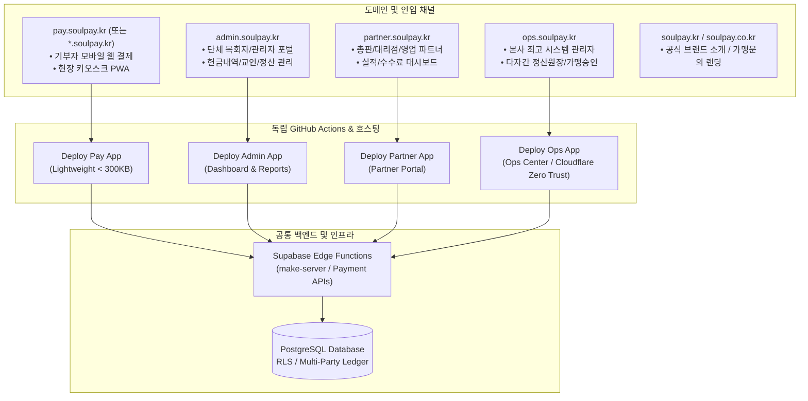

# [Architecture Plan] SoulPay 도메인 및 배포 파이프라인 완전 분리 계획서
> **문서 버전**: v1.0.0  
> **작성 일자**: 2026-09-09  
> **상태**: 승인 대기 / 실행 대기 (내일 착수 예정)  
> **목표 오픈 시점**: 상용 서비스 런칭 전 분리 완료  

---

## 1. 개요 및 추진 배경 (Executive Summary)

### 1.1 현황 및 배경
- **현황**: React.lazy 기반 도메인별 라우트 코드 스플리팅을 적용하여 메인 번들 크기를 2.1MB에서 155KB로 93% 경량화하였습니다.
- **도메인 연결 완료**: 보유 도메인인 `soulpay.kr` 및 `soulpay.co.kr`이 성공적으로 연결되어 인프라 연동 준비가 완료되었습니다.
- **상용 서비스 운영 리스크 (Monolithic Blast Radius)**:
  - 현재는 **단일 모놀리식 SPA 및 단일 배포 파이프라인**으로 묶여 있어, 단체 관리자 포털이나 파트너 화면의 단순 버그 패치/UI 수정 시에도 **기부자 결제 코어 및 현장 키오스크 전체가 재빌드/재배포**되는 위험이 존재합니다.
  - 상용 오픈 후 결제 서비스 장애는 즉각적인 매출 및 기부 손실로 이어지므로, 결제 엔진을 다른 관리자 화면과 **물리적으로 완전히 격리(Zero Blast Radius)**해야 합니다.

### 1.2 핵심 목표
1. **도메인별 물리적 격리**: `pay.soulpay.kr`, `admin.soulpay.kr`, `partner.soulpay.kr`, `ops.soulpay.kr` 4대 독립 서브도메인 체계 확립.
2. **독립 CI/CD 배포 파이프라인 구축**: 변경된 영역만 독립 빌드/배포하여 결제 서비스 무중단 99.99% SLA 보장.
3. **상용 오픈 일정 준수 (2단계 전략)**: 오픈 전에는 무위험 **Multi-Target Vite SPA 빌드**로 1영업일 내 신속 컷오버를 달성하고, 오픈 후 안정화 단계에서 **Turborepo Monorepo**로 확장.

---

## 2. 도메인 및 서비스 격리 아키텍처



### 2.1 도메인 매핑 정의표

| 서브도메인 | 서비스 대상 | 주요 기능 | 성능 / 보안 요구사항 |
| :--- | :--- | :--- | :--- |
| **`pay.soulpay.kr`**<br/>(또는 `*.soulpay.kr`) | 기부자, 성도, 신도, 현장 키오스크 | 간편결제(카카오/네이버/토스/신용카드), 정기구독 신청, 전자영수증, 키오스크 화면 | • 번들 초경량화 (< 300KB)<br/>• 무중단 99.99% SLA<br/>• 관리자 번들 의존성 0% |
| **`admin.soulpay.kr`** | 개별 단체(교회/성당/사찰) 관리자 | 헌금 내역 관리, 당일 마감 집계, 교인 관리, 정산 보고서, 단체 설정 | • 세션 격리 (단체 테넌트 단위)<br/>• 엑셀 다운로드, 통계 차트 |
| **`partner.soulpay.kr`** | 영업 총판, 대리점, 파트너 | 가맹 단체 유치 현황, 영업 실적 분석, 수수료 정산 내역 | • 파트너 전용 세션 격리<br/>• 단체 관리자 데이터 접근 원천 차단 |
| **`ops.soulpay.kr`** | 본사 최고 운영 관리자 | 가맹 승인 심사, 다자간 정산 원장(Ledger), 시스템 수수료 설정 | • Cloudflare Access (IP 화이트리스트)<br/>• 2단계 인증 필수 |
| **`soulpay.co.kr`**<br/>(및 `soulpay.kr` root) | 일반 방문자, 도입 희망 단체 | 솔루션 소개, 가맹 상담 신청, 고객 지원 | • 정적 CDN 캐싱, SEO 최적화 |

---

## 3. 코드베이스 구조 및 빌드 전략

> [!IMPORTANT]
> **오픈 일정 지연 방지 원칙**: 오픈이 임박한 상태에서 수백 개 파일의 디렉토리를 `apps/`와 `packages/`로 물리 이동할 경우, 상대 경로 깨짐 및 의존성 충돌로 인한 롤백 위험이 매우 큽니다.  
> 따라서 **Phase A(오픈 전)**에는 동일 레포지토리 내 **Multi-Target Vite SPA 빌드**로 안전하게 파이프라인을 분리하고, **Phase B(오픈 후)**에 Turborepo로 마이그레이션합니다.

### 3.1 [Phase A] Multi-Target Vite 빌드 (오픈 전 적용)
- 기존 파일 디렉토리를 유지하여 참조 깨짐 리스크 0% 달성.
- 앱별 독립 엔트리포인트 및 라우터 분리:
  - `src/entries/pay.tsx` & `src/routes/payRoutes.tsx`
  - `src/entries/admin.tsx` & `src/routes/adminRoutes.tsx`
  - `src/entries/partner.tsx` & `src/routes/partnerRoutes.tsx`
  - `src/entries/ops.tsx` & `src/routes/opsRoutes.tsx`
- 빌드 스크립트 분기 (`package.json`):
  ```bash
  pnpm build:pay      # dist/pay/ 생성 (결제 전용 초경량 산출물)
  pnpm build:admin    # dist/admin/ 생성 (단체 관리자 포털)
  pnpm build:partner  # dist/partner/ 생성 (파트너 포털)
  pnpm build:ops      # dist/ops/ 생성 (시스템 관리자 포털)
  ```
- 호스팅(Cloudflare Pages 또는 Vercel)에 4개 독립 프로젝트를 연결하여 각 빌드 명령어와 도메인을 1:1 매핑.

### 3.2 [Phase B] Turborepo Monorepo (오픈 후 안정화 단계)
- `apps/` (`pay`, `admin`, `partner`, `ops`)
- `packages/` (`ui`, `api-client`, `types`, `utils`)

---

## 4. 소요 시간 및 작업 일정표

- **전체 예상 소요 시간**: **약 6 ~ 9시간** (집중 작업 시 1영업일 이내 완료 가능)
- **AI(Antigravity) + 사용자 협업 분담**:
  - **AI 전담 (약 2~3시간)**: 앱별 엔트리/라우터 분리, `vite.config.ts` 멀티 타겟 빌드 구성, GitHub Actions 워크플로우 4종 작성, 하드코딩 검증 통과.
  - **사용자 전담 (약 1~2시간)**: DNS CNAME 서브도메인 등록, 호스팅 프로젝트 생성 및 토큰 등록.
  - **공동 진행 (약 2~3시간)**: 실결제(카카오/토스/나이스) 콜백 확인, 서브도메인 간 크로스 링크 검증, 상용 컷오버.

| 단계 | 작업 내용 | 예상 소요 시간 | 작업 주체 |
| :---: | :--- | :---: | :---: |
| **Phase 1** | **인프라 & DNS 준비**<br/>• 서브도메인 CNAME 4개 등록 (`pay`, `admin`, `partner`, `ops`)<br/>• SSL/TLS 인증서 발급 확인<br/>• 호스팅 플랫폼 프로젝트 4개 생성 및 환경변수 등록 | **1 ~ 2시간** | 사용자<br/>(AI 가이드) |
| **Phase 2** | **엔트리 & 라우터 분리**<br/>• 앱별 독립 라우터 4종 작성<br/>• 앱별 HTML 템플릿 및 엔트리포인트 생성<br/>• `vite.config.ts` 멀티 타겟 빌드 설정 및 스크립트 등록<br/>• Zero-Hardcoding 무결성 검증 (`pnpm check:hardcoding`) | **1.5 ~ 2시간** | **AI 전담** |
| **Phase 3** | **독립 CI/CD 파이프라인 구축**<br/>• GitHub Actions 워크플로우 4종 작성 (`deploy-*.yml`)<br/>• 소스 경로(`paths:`) 기반 독립 배포 트리거 설정<br/>• 자동 배포 테스트 및 각 서브도메인 배포 성공 확인 | **1 ~ 1.5시간** | **AI 전담** +<br/>토큰 등록 |
| **Phase 4** | **통합 검증 및 상용 컷오버**<br/>• 서브도메인별 정상 접속 및 번들 크기(< 300KB) 확인<br/>• 실결제(PG) 및 승인 후 리다이렉트 URL 정상 동작 검증<br/>• 단체 관리자 ↔ 기부자 화면 크로스 링크 연동 확인<br/>• 최종 상용 컷오버 완료 | **2 ~ 3시간** | **공동 진행** |

---

## 5. 단계별 상세 실행 체크리스트

### [Phase 1] 사전 인프라 및 DNS 구성
- [ ] **DNS 서브도메인 CNAME 레코드 등록 (Cloudflare 또는 DNS 관리자)**
  - [ ] `pay.soulpay.kr` -> 호스팅 타겟 CNAME
  - [ ] `admin.soulpay.kr` -> 호스팅 타겟 CNAME
  - [ ] `partner.soulpay.kr` -> 호스팅 타겟 CNAME
  - [ ] `ops.soulpay.kr` -> 호스팅 타겟 CNAME
  - [ ] `soulpay.kr` / `soulpay.co.kr` (root 및 www) -> 랜딩 페이지 CNAME
- [ ] **SSL/TLS 와일드카드 인증서 (`*.soulpay.kr`) 발급 상태 확인**
- [ ] **호스팅 플랫폼 프로젝트 4개 생성 (Cloudflare Pages 또는 Vercel)**
  - [ ] `soulpay-pay` (Build command: `pnpm build:pay`, Output: `dist/pay`)
  - [ ] `soulpay-admin` (Build command: `pnpm build:admin`, Output: `dist/admin`)
  - [ ] `soulpay-partner` (Build command: `pnpm build:partner`, Output: `dist/partner`)
  - [ ] `soulpay-ops` (Build command: `pnpm build:ops`, Output: `dist/ops`)
- [ ] **공통 환경 변수 일괄 등록 (`VITE_SUPABASE_URL`, `VITE_SUPABASE_ANON_KEY` 등)**

### [Phase 2] 코드베이스 엔트리 및 라우터 분리
- [ ] **앱별 독립 라우터 생성 (`src/routes/`)**
  - [ ] `payRoutes.tsx`: `/:tenantSlug`, `/:tenantSlug/donate`, `/payment`, `/complete`, `/kiosk`, `/my-donations`, `/tax-receipt`
  - [ ] `adminRoutes.tsx`: `/:tenantSlug/admin/**`, `/admin/login`
  - [ ] `partnerRoutes.tsx`: `/partner/**`, `/agency/**`, `/agent/**`
  - [ ] `opsRoutes.tsx`: `/system/admin/**`, `/system/login`
- [ ] **앱별 HTML 템플릿 및 엔트리 TSX 작성**
  - [ ] `index.pay.html` & `src/entries/pay.tsx`
  - [ ] `index.admin.html` & `src/entries/admin.tsx`
  - [ ] `index.partner.html` & `src/entries/partner.tsx`
  - [ ] `index.ops.html` & `src/entries/ops.tsx`
- [ ] **`vite.config.ts` 멀티 타겟 환경 변수(`BUILD_TARGET`) 빌드 로직 추가**
- [ ] **`package.json` 빌드 스크립트 분리 (`build:pay`, `build:admin`, `build:partner`, `build:ops`)**
- [ ] **Zero-Hardcoding 자동 검사 (`pnpm check:hardcoding`) 0건 통과 확인**

### [Phase 3] 독립 CI/CD 배포 파이프라인 구축
- [ ] **GitHub Actions 워크플로우 4종 작성 (`.github/workflows/`)**
  - [ ] `deploy-pay.yml` (`paths: ['src/app/pages/Tenant*.tsx', 'src/app/pages/Payment*.tsx', ...]`)
  - [ ] `deploy-admin.yml` (`paths: ['src/app/pages/admin/**', ...]`)
  - [ ] `deploy-partner.yml` (`paths: ['src/app/pages/partner/**', 'src/app/pages/agent/**', ...]`)
  - [ ] `deploy-ops.yml` (`paths: ['src/app/pages/admin/System*', 'src/app/pages/admin/Settlement*', ...]`)
- [ ] **GitHub Secrets 등록 및 워크플로우 자동 배포 트리거 테스트**

### [Phase 4] 실환경 검증 및 상용 컷오버
- [ ] **도메인별 접속 및 초경량 번들 크기 확인**
  - [ ] `pay.soulpay.kr/:slug` 접속 시 즉시 로딩 (< 300KB 번들)
  - [ ] 관리자 기능 코드 유입 여부 확인 (완전 차단 확인)
- [ ] **실결제(PG) 연동 및 리다이렉트 검증**
  - [ ] 카카오페이 / 토스페이 / 나이스페이 승인 콜백 및 리다이렉트 URL 확인
- [ ] **서브도메인 간 크로스 링크 연동 확인**
  - [ ] 단체 관리자에서 "기부자 화면 보기" 클릭 시 `pay.soulpay.kr/:slug` 새 창 정상 이동
- [ ] **시스템 관리자(`ops.soulpay.kr`) 보안 접근 제어 확인**
- [ ] **상용 컷오버 선언 및 완료**

---

## 6. 장애 대책 및 롤백 계획 (Rollback Strategy)

1. **DNS 레벨 즉시 롤백 (복구 시간 < 5분)**:
   - 신규 서브도메인 환경에서 예기치 못한 이슈 발생 시, 기존 정상 운영 중인 모놀리식 프로덕션 URL로 DNS CNAME을 즉시 재연결합니다.
2. **Git 브랜치 격리**:
   - 도메인 분리 작업은 `feat/domain-pipeline-isolation` 브랜치에서 수행하며, 모든 검증 완료 후 `main`에 Squash 머지합니다.
3. **PG 결제 콜백 URL 안정성**:
   - 결제 요청 시 서버에 전달하는 승인 후 `return_url`을 호출 도메인(`window.location.origin`) 기준으로 동적 생성하여 도메인 간 결제 꼬임을 방지합니다.
