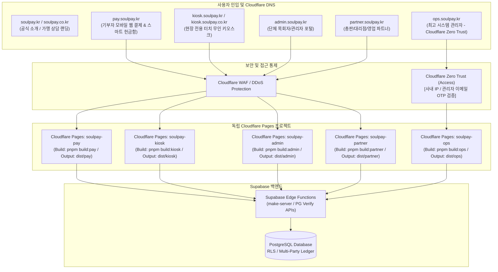

# [Architecture Plan] SoulPay 도메인 및 배포 파이프라인 완전 분리 계획서 (Cloudflare 통합 기반)
> **문서 버전**: v1.1.0  
> **작성 일자**: 2026-09-09  
> **호스팅 인프라**: **Cloudflare Pages + Cloudflare DNS + Zero Trust**  
> **목표 오픈 시점**: 상용 서비스 런칭 전 분리 완료  

---

## 1. 개요 및 인프라 선정 배경 (Executive Summary)

### 1.1 현황 및 배경
- **현황**: React.lazy 기반 도메인별 라우트 코드 스플리팅을 적용하여 메인 번들 크기를 2.1MB에서 155KB로 93% 경량화 완료.
- **보유 도메인**: `soulpay.kr`, `soulpay.co.kr` 보유 및 연결 준비 완료.
- **모놀리식 배포의 치명적 리스크**:
  - 단체 관리자 포털이나 파트너 화면의 단순 버그 수정/배포 시에도 **기부자 결제 코어 및 현장 키오스크 전체가 재빌드/재배포**되는 위험(Blast Radius)이 존재합니다.
  - 상용 오픈 전 결제 서비스의 **무중단 SLA(99.99%)**를 보장하기 위해 도메인 및 배포 파이프라인의 물리적 완전 분리가 필수적입니다.

### 1.2 왜 Vercel이 아닌 Cloudflare인가? (인프라 선정 근거)

| 비교 항목 | Vercel | Cloudflare (Pages + DNS + Zero Trust) | 최종 결정 이유 |
| :--- | :--- | :--- | :--- |
| **트래픽 & 대역폭 비용** | • 트래픽 급증 시 대역폭 추가 과금 위험<br/>• 상업용 팀 계정 인당 $20/월 | • **무제한 대역폭 (Bandwidth 무제한)**<br/>• 요청 수 무제한 (Free/Pro 모두) | 주일 헌금, 성탄절 등 일시적 트래픽 폭증 시 **요금 폭탄 위험 0%** |
| **결제/금융 보안 (WAF & DDoS)** | • 기본 보안만 제공<br/>• 고급 WAF는 엔터프라이즈 전용 | • **글로벌 1위 DDoS 완화 및 WAF 기본 탑재**<br/>• 악성 봇 차단(Bot Fight Mode) | 결제 인입 경로(`pay.soulpay.kr`) 악성 트래픽 원천 차단 |
| **시스템 관리자 보안 (`ops`)** | • 특정 IP 제한 시 고가 플랜 필요 | • **Cloudflare Zero Trust 무료 연동 (최대 50명)**<br/>• 사내 IP 또는 관리자 이메일 OTP 강제 | 최고 관리자 화면(`ops.soulpay.kr`)의 외부 해킹 위험 원천 차단 |
| **DNS & SSL 연동성** | • 외부 DNS에서 CNAME 수동 관리 | • **DNS + CDN + Pages 원클릭 통합**<br/>• 와일드카드 SSL(`*.soulpay.kr`) 자동 갱신 | 네임서버를 Cloudflare에 두면 서브도메인 관리가 압도적으로 용이 |
| **정적 SPA 최적화** | • Next.js(SSR) 최적화 플랫폼 | • **Vite 기반 순수 정적 SPA 최적화**<br/>• 서울 에지(ICN PoP) 초고속 캐싱 | SoulPay 프론트엔드는 순수 Vite SPA이므로 성능/비용 극대화 |

---

## 2. Cloudflare 기반 격리 아키텍처 다이어그램



---

## 3. Cloudflare 이전 및 셋업 상세 명세

### 3.1 [Step 1] 도메인 네임서버(DNS) Cloudflare 위임
1. **도메인 등록기관(가비아, 후이즈 등) 접속**:
   - `soulpay.kr` 및 `soulpay.co.kr`의 1차/2차 네임서버를 Cloudflare에서 지정해주는 2개의 네임서버(예: `***.ns.cloudflare.com`)로 변경.
2. **Cloudflare DNS 레코드 구성**:
   - `pay.soulpay.kr` -> `soulpay-pay.pages.dev` (CNAME, Proxied: 켜짐 🟧)
   - `kiosk.soulpay.kr` / `kiosk.soulpay.co.kr` -> `soulpay-kiosk.pages.dev` (CNAME, Proxied: 켜짐 🟧)
   - `admin.soulpay.kr` -> `soulpay-admin.pages.dev` (CNAME, Proxied: 켜짐 🟧)
   - `partner.soulpay.kr` -> `soulpay-partner.pages.dev` (CNAME, Proxied: 켜짐 🟧)
   - `ops.soulpay.kr` -> `soulpay-ops.pages.dev` (CNAME, Proxied: 켜짐 🟧)
   - `soulpay.kr` / `soulpay.co.kr` -> 공식 랜딩용 CNAME
3. **SSL/TLS 암호화 모드**: **Full (Strict)** 또는 **Full** 설정 (Cloudflare Universal SSL 자동 적용).

---

### 3.2 [Step 2] Cloudflare Pages 5개 프로젝트 생성 명세

| 프로젝트명 | 도메인 | 빌드 명령어 | 출력 디렉터리 | 환경 변수 |
| :--- | :--- | :--- | :--- | :--- |
| **`soulpay-pay`** | `pay.soulpay.kr` | `pnpm build:pay` | `dist/pay` | `VITE_SUPABASE_URL`<br/>`VITE_SUPABASE_ANON_KEY`<br/>`VITE_APP_MODE=pay` |
| **`soulpay-kiosk`** | `kiosk.soulpay.kr`<br/>`kiosk.soulpay.co.kr` | `pnpm build:kiosk` | `dist/kiosk` | `VITE_SUPABASE_URL`<br/>`VITE_SUPABASE_ANON_KEY`<br/>`VITE_APP_MODE=kiosk` |
| **`soulpay-admin`** | `admin.soulpay.kr` | `pnpm build:admin` | `dist/admin` | `VITE_SUPABASE_URL`<br/>`VITE_SUPABASE_ANON_KEY`<br/>`VITE_APP_MODE=admin` |
| **`soulpay-partner`**| `partner.soulpay.kr`| `pnpm build:partner`| `dist/partner` | `VITE_SUPABASE_URL`<br/>`VITE_SUPABASE_ANON_KEY`<br/>`VITE_APP_MODE=partner` |
| **`soulpay-ops`** | `ops.soulpay.kr` | `pnpm build:ops` | `dist/ops` | `VITE_SUPABASE_URL`<br/>`VITE_SUPABASE_ANON_KEY`<br/>`VITE_APP_MODE=ops` |

> **SPA 라우팅 보장 설정**:  
> Cloudflare Pages는 SPA의 딥 링크(`/:slug/donate`, `/admin/history` 등) 처리를 위해 각 빌드 출력 폴더(`dist/*/`)에 `_redirects` 파일(`/* /index.html 200`)을 자동으로 생성하도록 빌드 스크립트에 통합합니다.

---

### 3.3 [Step 3] 시스템 관리자(`ops.soulpay.kr`) Zero Trust 보안 셋업
1. **Cloudflare Zero Trust 대시보드 진입** (무료 50인 라이선스 자동 활성화).
2. **Access Application 등록**:
   - Application Name: `SoulPay Ops Portal`
   - Application Domain: `ops.soulpay.kr`
3. **Access Policy (접근 정책) 규칙 생성**:
   - **Rule 1 (사내 고정 IP 허용)**: Action: `Allow`, Selector: `IP Ranges` (사내 공인 IP)
   - **Rule 2 (관리자 이메일 OTP 허용)**: Action: `Allow`, Selector: `Emails` (지정된 관리자 계정 이메일로 6자리 핀코드 전송)
4. **효과**: 해커나 외부인이 `https://ops.soulpay.kr`에 접속하더라도 프론트엔드 코드 화면 자체가 뜨지 않고 Cloudflare의 강력한 로그인 인증 화면에서 1차 차단됩니다.

---

## 4. 코드베이스 분리 전략 (Phase A: Multi-Target Vite)

상용 오픈 전 코드 참조 오류를 방지하기 위해 단일 레포 내에서 **Multi-Target Vite SPA 빌드**를 수행합니다.

### 4.1 앱별 독립 엔트리 및 라우터 구성
- `src/entries/pay.tsx` & `src/routes/payRoutes.tsx`
  - 기부자 모바일 메인, 결제 진행, 납부 내역, 영수증 센터
- `src/entries/kiosk.tsx` & `src/routes/kioskRoutes.tsx`
  - 현장 무인 키오스크 전용 (가상 한글 키보드, 전신 터치 UI, 영수증 출력)
- `src/entries/admin.tsx` & `src/routes/adminRoutes.tsx`
  - 단체 관리자 로그인, 헌금 내역, 마감 집계, 교인 관리, 정산 보고서, 단체 설정
- `src/entries/partner.tsx` & `src/routes/partnerRoutes.tsx`
  - 파트너 로그인, 파트너 대시보드, 가맹 단체 등록, 수수료 정산
- `src/entries/ops.tsx` & `src/routes/opsRoutes.tsx`
  - 시스템 관리자 대시보드, 가맹 승인 심사, 다자간 정산 원장, 시스템 환경 설정

### 4.2 `package.json` 빌드 스크립트
```json
{
  "scripts": {
    "build:pay": "BUILD_TARGET=pay vite build && cp public/_redirects dist/pay/",
    "build:kiosk": "BUILD_TARGET=kiosk vite build && cp public/_redirects dist/kiosk/",
    "build:admin": "BUILD_TARGET=admin vite build && cp public/_redirects dist/admin/",
    "build:partner": "BUILD_TARGET=partner vite build && cp public/_redirects dist/partner/",
    "build:ops": "BUILD_TARGET=ops vite build && cp public/_redirects dist/ops/"
  }
}
```

---

## 5. 소요 시간 및 작업 일정표

- **전체 예상 소요 시간**: **약 6 ~ 9시간 (약 1영업일 이내)**
- **Cloudflare 전환 시 추가 시간**: 단 **15~30분** (네임서버 변경 및 프로젝트 생성)

| 단계 | 작업 내용 | 소요 시간 | 주체 |
| :---: | :--- | :---: | :---: |
| **Phase 1** | **Cloudflare DNS & Pages 인프라 셋업**<br/>• 도메인 네임서버 Cloudflare로 위임<br/>• Cloudflare Pages 프로젝트 4개 생성 및 GitHub 레포 연결<br/>• `ops.soulpay.kr` Zero Trust 접근 정책 등록 | **1.5 ~ 2시간** | 사용자<br/>(AI 가이드) |
| **Phase 2** | **코드베이스 엔트리 & 라우터 분리**<br/>• 앱별 독립 라우터 4종 분리<br/>• 앱별 HTML 템플릿 및 엔트리 TSX 작성<br/>• `vite.config.ts` 멀티 타겟 빌드 구성<br/>• `pnpm check:hardcoding` 무결성 검증 | **1.5 ~ 2시간** | **AI 전담** |
| **Phase 3** | **Cloudflare 배포 파이프라인 연동**<br/>• Cloudflare Pages 빌드 명령어 및 환경변수 매핑<br/>• push 트리거를 통한 앱별 독립 빌드/배포 확인<br/>• SPA `_redirects` 딥링크 라우팅 검증 | **1 ~ 1.5시간** | **공동 진행** |
| **Phase 4** | **실환경 결제 검증 및 상용 컷오버**<br/>• 서브도메인별 초경량 번들 로딩 속도 검증 (< 300KB)<br/>• 카카오페이/토스/나이스 실결제 콜백 및 리다이렉트 검증<br/>• 단체 관리자 ↔ 기부자 화면 크로스 링크 연동 확인<br/>• 최종 상용 컷오버 선언 | **2 ~ 3시간** | **공동 진행** |

---

## 6. 단계별 상세 실행 체크리스트

### [Phase 1] Cloudflare DNS 및 인프라 셋업
- [ ] 도메인 등록기관(가비아 등)에서 `soulpay.kr`, `soulpay.co.kr` 네임서버를 Cloudflare로 변경
- [ ] Cloudflare DNS 레코드 활성화 (`pay`, `admin`, `partner`, `ops` 4개 CNAME 등록)
- [ ] Cloudflare SSL/TLS 암호화 모드 `Full` 확인
- [ ] Cloudflare Pages 프로젝트 4종 생성 및 GitHub 저장소 연결
- [ ] Cloudflare Zero Trust 대시보드에서 `ops.soulpay.kr` 접근 정책(IP 또는 이메일 OTP) 설정

### [Phase 2] 코드베이스 엔트리 및 라우터 분리
- [ ] `src/routes/payRoutes.tsx`, `adminRoutes.tsx`, `partnerRoutes.tsx`, `opsRoutes.tsx` 분리 작성
- [ ] `index.pay.html`, `index.admin.html`, `index.partner.html`, `index.ops.html` 엔트리 생성
- [ ] `vite.config.ts`에 `process.env.BUILD_TARGET`에 따른 빌드 입력/출력 경로 동적 분기 로직 구현
- [ ] `package.json`에 `build:pay`, `build:admin`, `build:partner`, `build:ops` 스크립트 등록
- [ ] 로컬에서 4개 타겟 빌드 테스트 성공 확인 (`dist/pay`, `dist/admin` 등)
- [ ] `pnpm check:hardcoding` 하드코딩 검사 0건 통과

### [Phase 3] 배포 파이프라인 및 SPA 딥링크 연동
- [ ] `public/_redirects` 생성 (`/* /index.html 200`)
- [ ] Cloudflare Pages 각 프로젝트의 Build Setting에 빌드 커맨드 및 출력 폴더 지정
- [ ] GitHub에 커밋 push 후 4개 프로젝트가 정상 배포되는지 확인
- [ ] 브라우저 새로고침 시 404 없이 해당 SPA 화면이 유지되는지(딥링크) 확인

### [Phase 4] 실결제 검증 및 최종 컷오버
- [ ] `https://pay.soulpay.kr/dream` 접속하여 번들 용량 및 로딩 시간(1초 이내) 확인
- [ ] 카카오페이 / 토스페이 / 나이스페이 실결제 후 승인 콜백 정상 처리 확인
- [ ] `https://admin.soulpay.kr/dream/admin` 로그인 및 헌금 내역/통계 정상 작동 확인
- [ ] `https://partner.soulpay.kr` 파트너 대시보드 로그인 및 권한 격리 확인
- [ ] `https://ops.soulpay.kr` 접속 시 Zero Trust 인증 화면 정상 차단 및 승인 확인
- [ ] 최종 상용 컷오버 완료

---

## 7. 비상 롤백 대책 (Rollback Strategy)

1. **DNS CNAME 즉각 전환 (복구 시간 1분 이내)**:
   - 신규 서브도메인 배포에 문제 발생 시, Cloudflare DNS 관리 콘솔에서 CNAME 대상을 기존 안정적인 Vercel 배포 URL로 즉시 전환 (Cloudflare 프록시 환경에서는 DNS 전파 대기 시간 없이 수초 내 즉각 반영).
2. **결제 PG 콜백 안전 장치**:
   - PG 결제 승인 요청 시 전달하는 `return_url`은 `window.location.origin`을 참조하므로 도메인 변경 시에도 추가 백엔드 코드 수정 없이 안전하게 동작.
